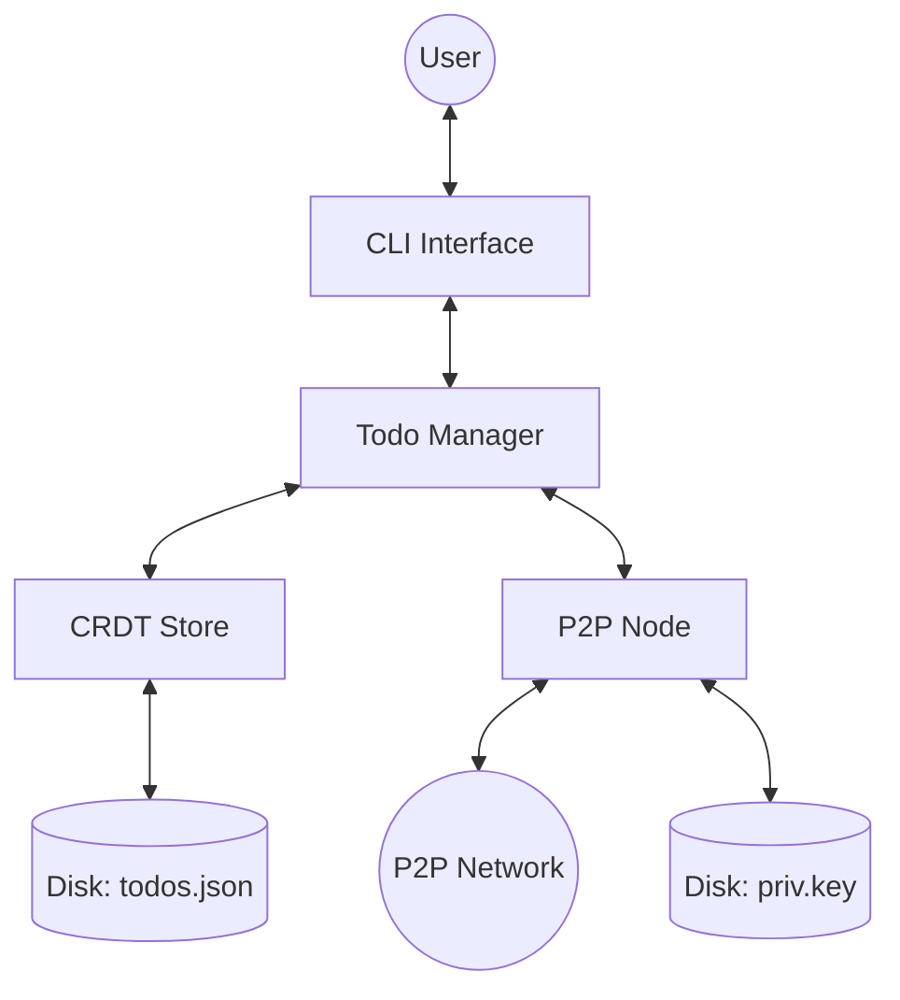

# Architecture: P2P Todo

## System Architecture Overview
The application follows a decentralized P2P architecture using `libp2p` for networking and a CRDT-based store for data consistency.

## Key Components
| Component | Path | Description |
|-----------|------|-------------|
| **Main Entry** | `main.go` | Orchestrates the CLI, store, and networking. |
| **P2P Node** | `p2p/node.go` | Handles libp2p setup, peer discovery (mDNS, DHT), and message broadcasting. |
| **CRDT Store** | `crdt/store.go` | Implements LWW-Map (Last-Write-Wins) logic and state merging. |
| **Todo Manager** | `todo/manager.go` | Business logic for managing todo items. |

## Design Patterns
- **P2P Networking**: Decentralized peer discovery and communication using `libp2p`.
- **CRDT (LWW-Map)**: Conflict-free Replicated Data Type for eventual consistency.
- **Tombstones**: Used for handling deletions in a decentralized environment to prevent "zombie" items.
- **Pub/Sub (GossipSub)**: Efficient message propagation across the network.

## Component Relationships
1. **CLI** captures user input and calls **Todo Manager**.
2. **Todo Manager** updates the **CRDT Store** and triggers a broadcast via **P2P Node**.
3. **P2P Node** receives updates from other peers and passes them to the **CRDT Store** for merging.
4. **CRDT Store** persists the state to **Disk** whenever changes occur.

## Key Directories
- `crdt/`: Logic for data synchronization and conflict resolution.
- `p2p/`: Networking configuration and node management.
- `todo/`: Higher-level todo item management.
- `.agent/`: Project intelligence and agent-specific files.
